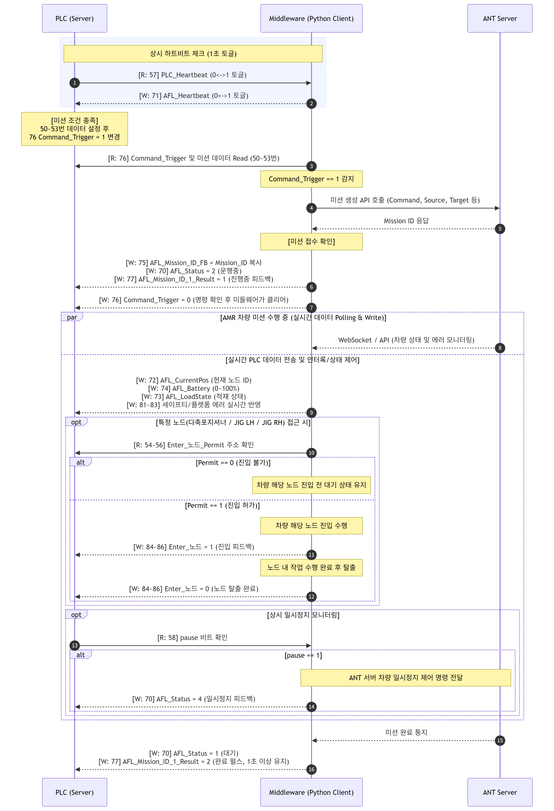
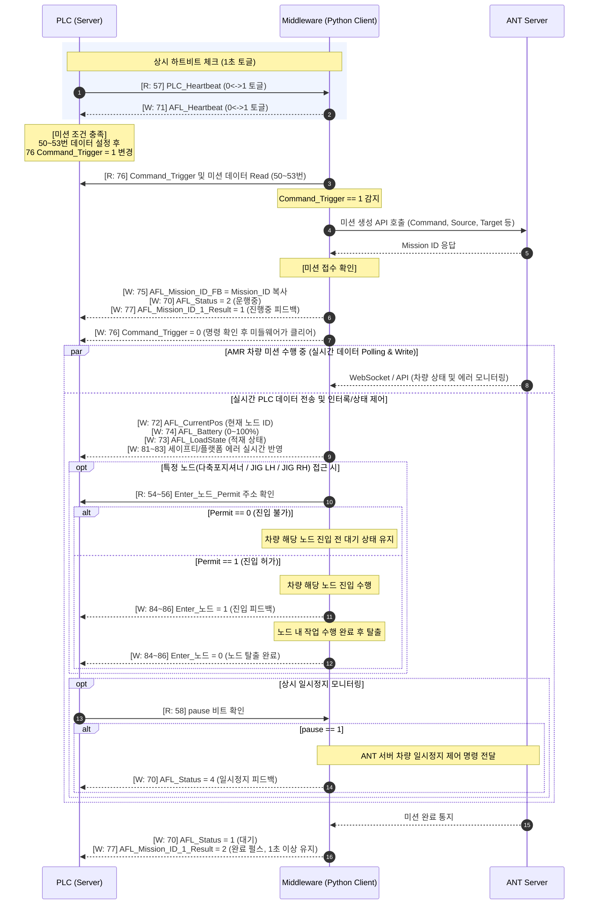

# PLC <-> Middleware <-> ANT 래더 플로우

## ModbusTCP_maptable

> R/W는 middleware 동작 기준으로 표기한다.
> * R (Read): PLC -> Middleware. PLC가 값을 쓰고 middleware가 읽는다.
> * W (Write) : Middleware -> PLC. middleware가 값을 쓰고 PLC가 읽는다.
> * 모든 주소는 `Donhee_ModbusTCP_MapTable`을 근거로 한다.

   

### Heartbeat (interval 1s)

| 주소 | 이름 | R/W (middleware 기준) | 의미 / 값 매핑 |
|------|------|----------------------|----------------|
| 57 | PLC_Heartbeat | R | PLC 생존 신호. 1초마다 0<->1 토글하여 middleware에 aliveness 통지 |
| 71 | AFL_Heartbeat | W | middleware 생존 신호. 1초마다 0<->1 토글하여 PLC에 aliveness 통지 |
   

### Read (` PLC -> middleware `)

| 주소 | 이름 (task / 필드) | R/W (middleware 기준) | 의미 / 값 매핑 |
|------|--------------------|----------------|----------------|
| 50 | Missin_ID | R | 작업번호 |
| 51 | Command | R | 작업명령, 'Pick & Drop' = 1, 'Drop & Pick' = 2 |
| 52 | Source_Pos | R | 출발위치, 'AFL 대기위치(충전소)' = 1, '다축포지셔너' = 2, 'FRT L ARM 간이 JIG LH' = 3, 'FRT L ARM 간이 JIG RH' = 4 |
| 53 | Target_Pos | R | 목적위치, 'AFL 대기위치(충전소)' = 1, '다축포지셔너' = 2, 'FRT L ARM 간이 JIG LH' = 3, 'FRT L ARM 간이 JIG RH' = 4 |
| 54 | Enter_다축포지셔너_Permit | R | '노드 진입 불가' = 0, '노드 진입 허가' = 1 |
| 55 | Enter_간이 JIG LH_Permit | R | '노드 진입 불가' = 0, '노드 진입 허가' = 1 |
| 56 | Enter_간이 JIG RH_Permit | R | '노드 진입 불가' = 0, '노드 진입 허가' = 1 |
| 57 | PLC_Heartbeat | R | PLC_Heartbeat |
| 58 | pause | R | '일시정지' = 1, afl이 하던 작업을 멈추고 일시정지 |

   

### Write (` middleware -> PLC `) - AFL Status

| 주소 | 이름 (task / 필드) | R/W (middleware 기준) | 의미 / 값 매핑 |
|------|--------------------|----------------|----------------|
| 70 | AFL_Status | W | AFL 현재상태, '미삽입' = 0(서버에 afl이 insert되어있지않음), '대기' = 1(서버에 afl이 insert 되어있음, 미션 수행가능 상태), '운행중' = 2(미션을 할당받아 수행중인 상태), '사용불가' = 3(서버에 afl이 insert 되어있지만 미션을 받을 수 없는 상태), '일시정지' = 4(사용자 명령에 의해 afl의 미션 수행이 일시 중단된 상태), '오류' = 99(차량에 심각한 하드웨어 결함이나 소프트웨어 에러가 발생, 정상적인 운행 불가능 상태) |
| 71 | AFL_Heartbeat | W | AFL_Heartbeat |
| 72 | AFL_CurrentPos | W | 현재 위치 노드 ID |
| 73 | AFL_LoadState | W | 파레트 적재 여부, '파레트 적재' = 1 |
| 74 | AFL_Battery | W | 배터리 (%), rage : 0- 100 |
| 75 | AFL_Mission_ID_FB | W | 수행 중인 작업번호, 30000 주소의 MissionID R 후 복사(W) |
| 76 | Command_Trigger | R/W | 명령실행 Trigger, R('Command'=1) 명령확인 후 미션생성시 W('Command'=0)  |
| 77 | AFL_Mission_ID_1_Result | W | 작업 결과, '미션 진행중' = 1, '미션 완료' = 2(pulse 형식 1초 이상 유지), 미션 중간에 추적취소시 완료신호 보냄. |
| 78 | AFL_Mission_ID_2_Result | W | 작업 결과, '미션 진행중' = 1, '미션 완료' = 2(pulse 형식 1초 이상 유지), 미션 중간에 추적취소시 완료신호 보냄. |
| 79 | AFL_Mission_ID_3_Result | W | 작업 결과, '미션 진행중' = 1, '미션 완료' = 2(pulse 형식 1초 이상 유지), 미션 중간에 추적취소시 완료신호 보냄. |
| 80 | AFL_Mission_ID_4_Result | W | 작업 결과, '미션 진행중' = 1, '미션 완료' = 2(pulse 형식 1초 이상 유지), 미션 중간에 추적취소시 완료신호 보냄. |
| 81 | SafetyLidar_Error | W | F/T/R/L 세이프티 라이다 센서 에러코드, 'LSC_F_Danger' = 1, 'LSC_L_Danger' = 2, 'LSC_R_Danger' = 3, 'LSC_T_Danger' = 4, 'LSC_F_Error' = 5, 'LSC_L_Error' = 6, 'LSC_R_Error' = 7, 'LSC_T_Error' = 8|
| 82 | Platform_Error | W | AFL 장비 에러, 'Error Lift SNR' = 1, 'Error Lifting' = 2, 'Error Tilting' = 3, 'Error Siding' = 4, 'Interlock' = 5, 'EMS' = 6, 'Door' = 7, 'Bumper' = 8, 'PLC Interlock' = 9 |
| 83 | SafetySensor_Error | W | 세이프티 센서 에러, 'Safety Forktip Detected Obstacle' = 1, 'Safety Load Detected Unload' = 2, 'Safety Load Detected Load' = 3 |
| 84 | Enter_다축포지셔너 | W | '진입' = 1, 노드 진입 시 1로 변경, 노드에서 빠져나오면서 0으로 변경 |
| 85 | Enter_간이 JIG LH | W | '진입' = 1, 노드 진입 시 1로 변경, 노드에서 빠져나오면서 0으로 변경 |
| 86 | Enter_간이 JIG RH | W | '진입' = 1, 노드 진입 시 1로 변경, 노드에서 빠져나오면서 0으로 변경 |

   

## Ladder Flow (Sequence Flow)

