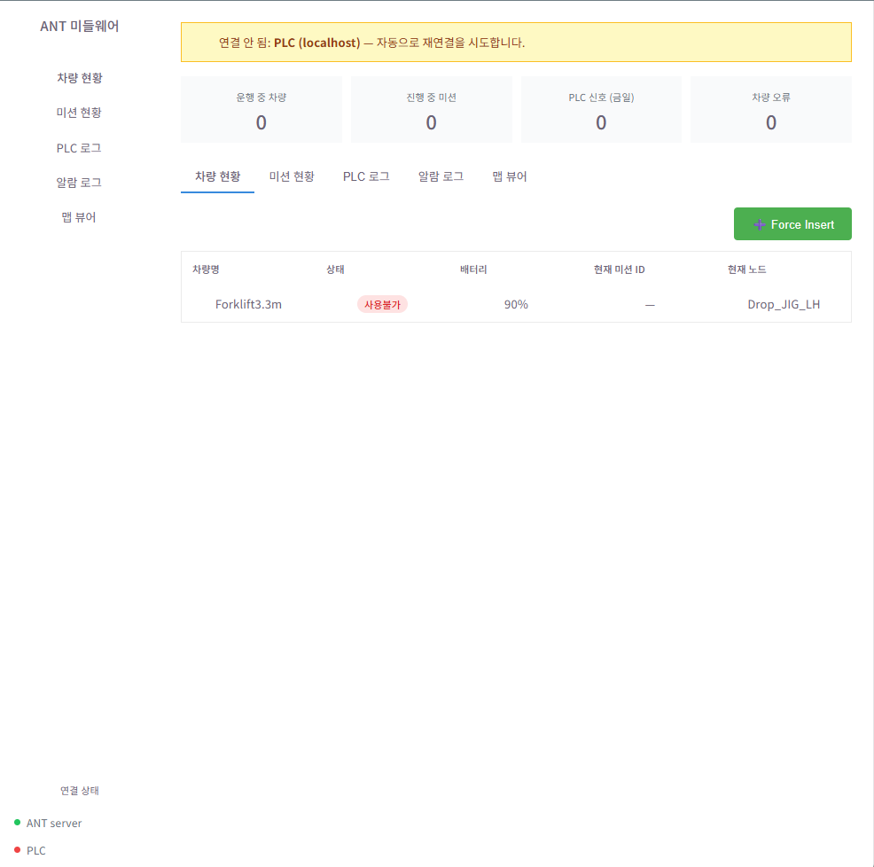
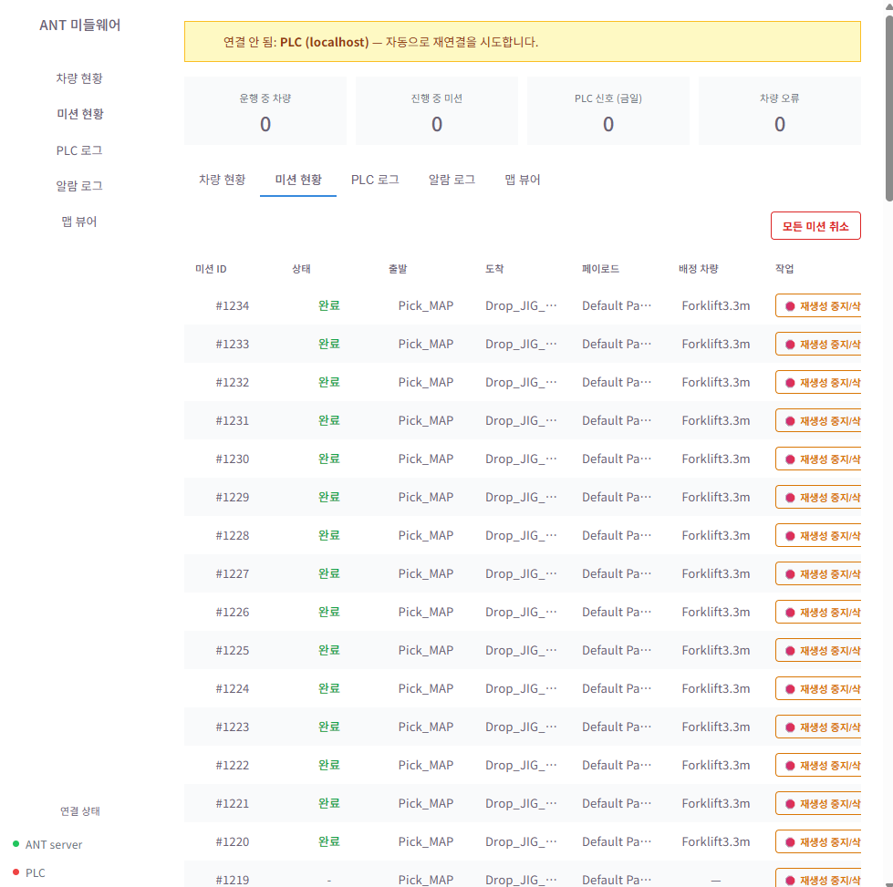
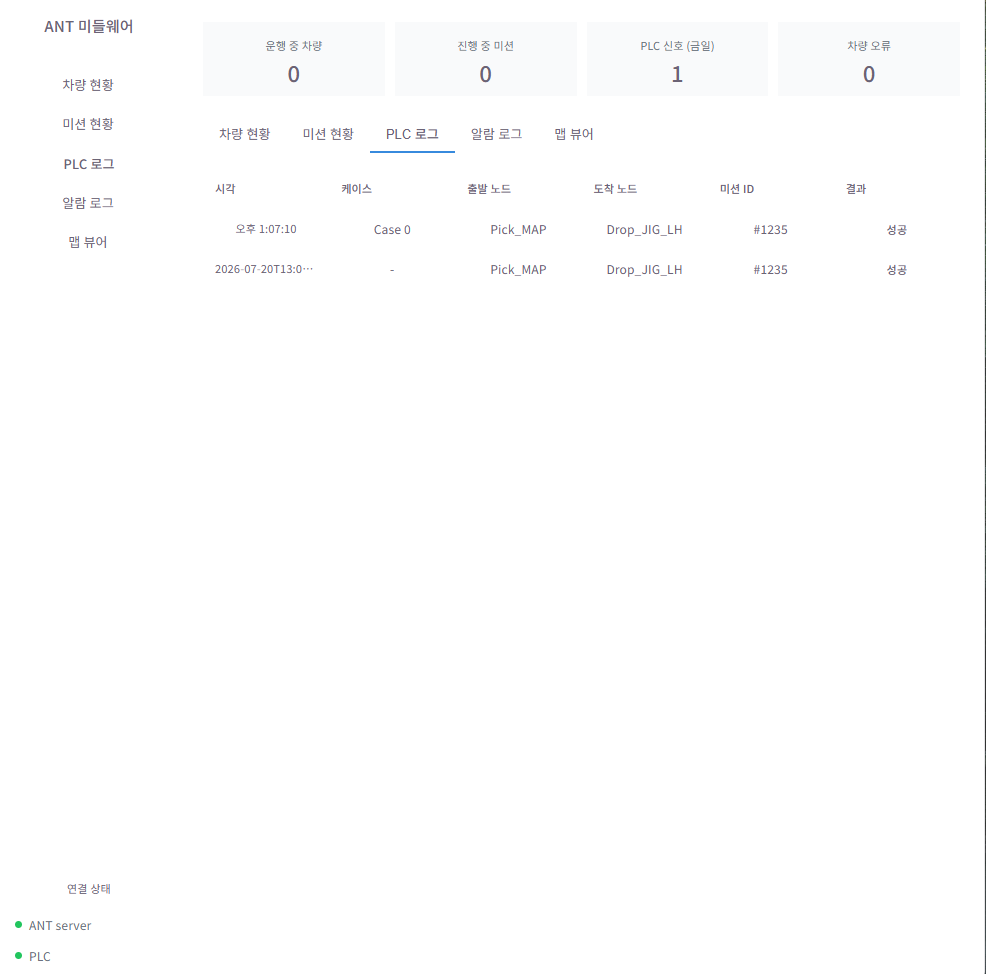
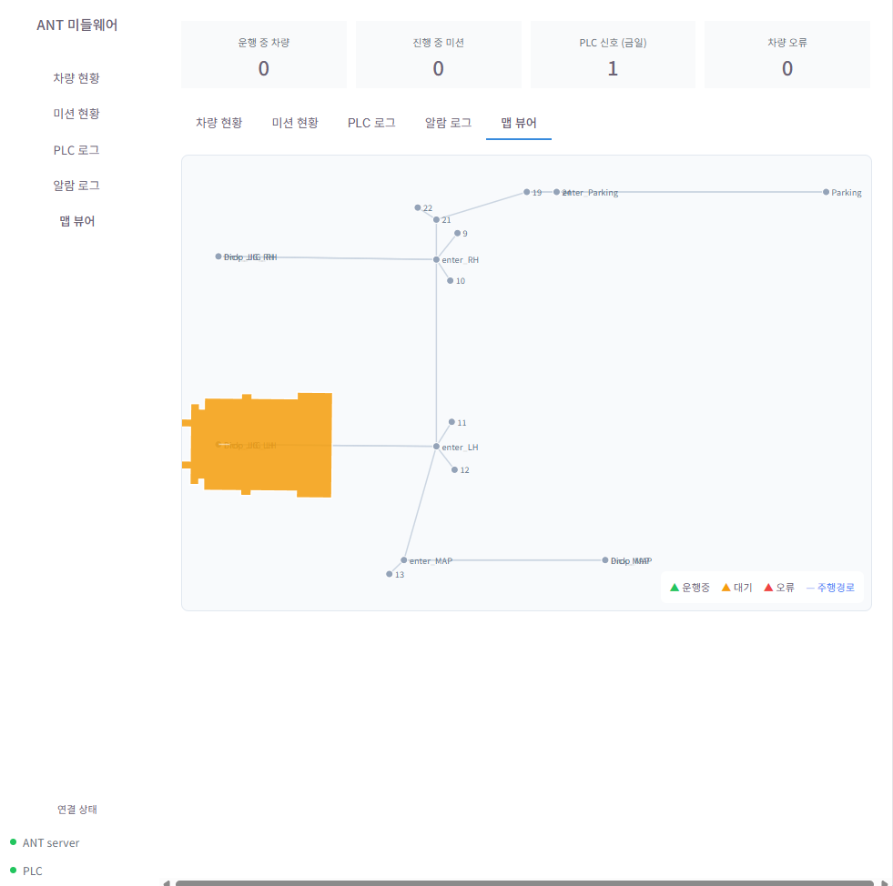

# 🚚 ANT-ACS Vehicle Monitoring System

> **ANT(Autonomous Navigation Technology) 서버 연동 기반 AGV/AMR 실시간 관제 및 맵 시각화 웹 애플리케이션**  
> 외부 로봇 제어 솔루션(ANT)과의 비동기 통신을 통해 실시간 차량 위치, 주행 경로, 차량 형상(Polygon) 및 대용량 맵 데이터를 정밀하게 시각화하는 모니터링 시스템입니다.

---

## 💡 Key Features (주요 기능)

### 1. **비동기 프록시 API 서버 (Backend)**
* **FastAPI 기반 프록시 엔드포인트 구축**: 외부 ANT 서버 API와의 직접적인 통신을 중계하고 비동기(`async/await`) 처리로 클라이언트 응답성 보장.
* **실시간 데이터 파이프라인**: 차량의 좌표, 진행 방향(Course), 주행 경로(`path`), 작동 상태(`operatingstate`), 알람(`alarms`) 데이터를 초 단위로 수집.
* **안정적인 에러 핸들링 & 로깅**: 네트워크 단절이나 외부 API 응답 오류 상황에 대비한 예외 처리 및 실시간 로그 수집 체계 구축.

### 2. **2D 맵 및 차량 실시간 관제 (Frontend)**
* **SVG 기반 동적 좌표 맵핑**: ANT 고유 좌표계를 SVG 픽셀 좌표로 자동 변환 (종횡비 유지 및 Y축 반전 기하 연산 적용).
* **차량 실시간 폴리곤(Polygon) 렌더링**: 차량 고유의 규격 데이터(`body.shape`)를 기반으로 실제 차량 크기와 회전각을 캔버스 위에 직관적으로 표현.
* **실시간 주행 경로 표시**: 차량별 진행 예정 경로(`path`)를 점선 하이라이트로 시각화.
* **차량 상태별 색상 범례**: 운행중(초록), 대기(주황), 오류(빨강) 등 직관적인 UI 제공.

---

## 🛠 Tech Stack & Architecture

### 1. Backend & Server Architecture
* **Core Language**: Python 3.10+
* **Web Framework**: FastAPI *(비동기 ASGI 기반 high-performance API 서버 구축)*
* **ASGI Server**: Uvicorn
* **Asynchronous I/O & HTTP**: `httpx` *(ANT 서버와의 비동기 HTTP/REST API 연동)*
* **Real-time Communication**: WebSocket (`ws_manager.py`) *(실시간 상태 및 로그 스트리밍)*
* **Industrial Protocol**: Modbus/TCP (`modbus_poller.py`) *(PLC 설비 상태 및 비트 신호 폴링)*
* **Data Storage & Cache**: SQLite / File-based DB (`db.py`) *(이벤트 로그 및 미션 모니터링 이력 저장)*

### 2. Frontend & Visualization
* **Core Library**: React.js
* **2D Rendering Engine**: HTML5 Native SVG Canvas *(차량 폼 팩터 `body.shape` 다각형 연산 및 회전 렌더링)*
* **State & Lifecycle Management**: React Hooks (`useState`, `useEffect`, `useCallback`, `useRef`)
* **Responsive Layout**: `ResizeObserver API` *(브라우저 창 크기에 맞춘 SVG 맵 스케일링)*
* **API Client**: Fetch API / Custom Async Client

### 3. Build, Packaging & System Integration
* **Desktop Packaging**: PyInstaller (`ANT_Interface_System.spec`) *(단일 실행 파일 `.exe` 패키징)*
* **Automation Script**: Bash Shell Script (`build.sh`)
* **Configuration Management**: YAML (`config.yaml`) *(서버 포트, ANT API URL, Modbus 레지스터 매핑 설정)*

### 4. Protocol & Documentation
* **Sequence & Ladder**: PLC Ladder Diagram, Sequence Flow (*PLC_Middleware_ANT_Ladder_Flow*)
* **Architecture Diagram**: Mermaid.js (`mermaid-diagram.png`)

---

## 📐 Architecture

```bash
[ Frontend (React) ]
│
▼  (REST API Polling)
[ Backend Proxy (FastAPI) ]
│
▼  (Async HTTP)
[ External ANT Server ]
```

---

## 🚀 Getting Started (시작 가이드)

### 1. Backend 및 Frontend 실행

```bash
# 레포지토리 클론
git clone [https://github.com/heejungdev00/DongheeACS.git](https://github.com/heejungdev00/DongheeACS.git)
cd server/main

# 가상환경 생성 및 패키지 설치
python -m venv venv
source venv/bin/activate  # Windows: venv\Scripts\activate
pip install -r requirements.txt

# 서버 실행 (기본 포트: 8000)
# uvicorn main:app --reload
sh build.sh
```

### 2. 실행파일 배포

```bash
# 배포파일 위치
cd server/dist/ANT_Interface_System

# 파일 실행
# ANT_Interface_System.exe 실행 후 localhost:8000 페이지
```
## 📸 Screenshots & Previews

### 차량 현황 페이지
* vehicle status 


### 미션 현황 페이지
* mission list


### 📋 PLC Communication & Event Log Viewer (PLC 로그 모니터링 화면)
* **실시간 PLC-ANT 핸드셰이크(Handshake) 이벤트 트래킹**
  * Modbus/TCP 통신을 통해 PLC 설비와 ANT 미들웨어 간에 주고받는 실시간 비트 신호 및 입출력 레지스터 데이터를 지속적으로 모니터링.

* **상태별/이벤트별 로그 필터링 & 디버깅 지원**
  * 정상 신호 교환, 미션 할당 이벤트, 통신 타임아웃, 예외 처리(Error) 등 로그 유형별 필터 기능 제공.
  * 현장 설비 동작 중 발생하는 신호 꼬임이나 예외 상황 발생 시 신속한 원인 파악 및 이력 추적(Traceability) 용이.

* **실시간 웹소켓(WebSocket) 및 폴링 기반 스트리밍**
  * 설비 상태 변화 발생 시 화면 이탈 없이 실시간으로 로그가 갱신되는 스트리밍 뷰어 구현.


### 🖥️ Real-time Map Viewer (실시간 맵 관제 화면)
* **2D 벡터 지도 정밀 시각화 (SVG Canvas)**
  * ANT 서버의 노드(Nodes) 및 링크(Links) 좌표 데이터를 수집하여 Web SVG 기반의 2D 맵으로 렌더링.
  * 종횡비(Aspect Ratio) 자동 유지 및 Y축 반전 기하 연산을 적용하여 실제 물류 현장 맵 규격과 1:1 동기화.

* **차량 실시간 폼 팩터(Body Shape) 폴리곤 렌더링**
  * 단순 아이콘이 아닌 차량의 실제 물리적 규격 데이터(`state['body.shape']`) 기반 8각 다각형(Polygon) 렌더링.
  * 차량의 진행 방향(Course/Heading Angle)을 라디안-디그리 연산으로 추적하여 실시간 회전 및 위치 추적 구현.

* **실시간 주행 경로(Path) 하이라이트**
  * 차량별 진행 예정 경로 노드 배열(`v.path`)을 점선 트랙으로 시각화하여 동선 교차 및 병목 구간 파악 용이.

* **상태별 시각적 피드백 & 사용자 친화적 UI**
  * 차량의 작동 상태(`operatingstate`)에 따른 상태별 컬러 매핑 (운행중: Green, 대기: Orange, 에러: Red).
  * 반응형 캔버스(`ResizeObserver`)로 모니터링 해상도 자동 맞춤.

## 📂 Project Structure

```bash
THIRD/
├── server/                        # 백엔드 및 인터페이스 시스템 메인
│   ├── modules/                   # 비즈니스 로직 및 외부 통신 모듈
│   │   ├── ant_api_base.py        # ANT API 기초 클래스 정의
│   │   ├── ant_client.py          # ANT 서버 통신 클라이언트
│   │   ├── ant_client_mock.py     # 테스트용 Mock 클라이언트
│   │   ├── ant_connector.py       # ANT 연결 상태 및 세션 관리
│   │   ├── db.py                  # 데이터베이스(DB) 연동 모듈
│   │   ├── mission_monitor.py     # 미션 실행 상태 모니터링
│   │   ├── modbus_poller.py       # PLC Modbus 폴링 처리 모듈
│   │   └── ws_manager.py          # 웹소켓(WebSocket) 커넥션 매니저
│   ├── static/                    # 프론트엔드 정적 빌드 파일 수집 폴더
│   ├── dist/                      # PyInstaller 실행 파일 빌드 결과물
│   │   └── ANT_Interface_System/  # 배포용 바이너리 패키지 (.exe)
│   ├── ANT_Interface_System.spec  # PyInstaller 빌드 스펙 설정 파일
│   ├── config.yaml                # 시스템 동작 및 연결 설정 파일
│   ├── main.py                    # FastAPI/백엔드 서버 진입점 (Entry Point)
│   └── requirements.txt           # 백엔드 의존성 라이브러리 목록
├── ui/                            # 프론트엔드 UI 웹 애플리케이션 (React)
├── venv/                          # Python Virtual Environment
├── build.sh                       # 자동화 빌드 스크립트
├── PLC_Middleware_ANT_Ladder_Flow # PLC-ANT 미들웨어 데이터 흐름 및 시퀀스/래더 로직 흐름도
└── README.md                      # 프로젝트 안내 문서

```